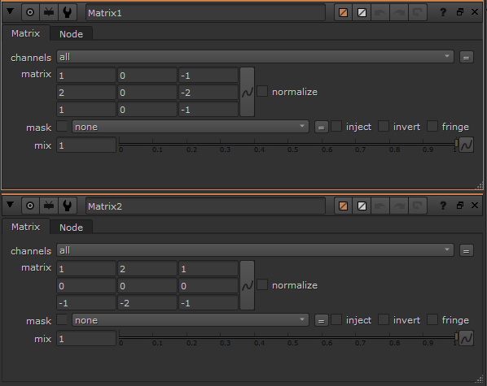

# Nuke_Sobelfilter
Sobel Filter using Nuke Composting

This code was developed for purely academic purposes as a part of the Module Motion Picture Engineering (EE5C1) in Trinity College Dublin.

Sobel filter is the basic image edge detection mechanism. For More on Sobel Filter, visit : https://en.wikipedia.org/wiki/Sobel_operator

The following node graph was created on Nuke for applying Soble Filter. 

## Steps for Sobel Filter
Step 1 : Connect Input Image to the viewer.

Step 2 : Add an expression to convert the RGB to YUV space. This can be done by applying the luminance expression as well, Y = R*0.21+G*0.71+B*0.07.

Step 3 : Blur the image using Blur property, keep opacity in range between 2.5 to 4.

Step 4 : Create the sobel Matrices and connect the blur to it.

Step 5 : Squre the matrices as per the defination by adding an expression.

Step 6 : Merge the expression and square them with another expression to get the final result, which becomes an edge detector.

